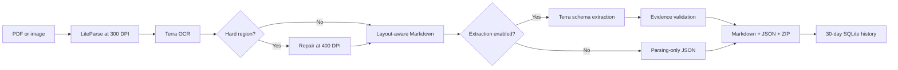

# LiteParse Agentic Document Extraction

[](https://github.com/pypi-ahmad/liteparse-agentic-document-extraction/actions/workflows/ci.yml)

Turn scanned PDFs and images into layout-aware Markdown. LiteParse reconstructs document
structure, while GPT-5.6 Terra performs OCR and identifies hard regions. Structured extraction
is optional.

## What it does

- Upload PDF or image files through the local Streamlit interface.
- Run OCR at 300 DPI, then verify difficult 400-DPI regions with two independent Terra reads.
- Produce layout-aware Markdown before any optional field extraction.
- Enable structured extraction when you need evidence-grounded JSON.
- Optionally generate, preview, and download a 300-DPI PDF with color-coded line annotations.
- Preview the source and results. Download Markdown, JSON, annotated PDF, or a ZIP archive.
- Keep source uploads in the current session and derived results in 30-day local history.



## Quick start

### Prerequisites

- Windows 11 and PowerShell
- [Git for Windows](https://git-scm.com/downloads/win)
- [uv](https://docs.astral.sh/uv/)
- `OPENAI_API_KEY` available to the process
- Optional `OPENAI_BASE_URL` for the configured compatible endpoint

Check that this PowerShell process has the required key without printing it:

```powershell
if ([string]::IsNullOrWhiteSpace($env:OPENAI_API_KEY)) {
    throw "OPENAI_API_KEY is unavailable; restart PowerShell after configuring it."
}
```

The selected endpoint must support the Responses API, strict structured output, image input,
and `gpt-5.6-terra`.

Clone and install:

```powershell
git clone https://github.com/pypi-ahmad/liteparse-agentic-document-extraction.git
cd liteparse-agentic-document-extraction
uv sync --all-groups --locked
```

Start the app:

```powershell
uv run liteparse-ade
```

Open <http://127.0.0.1:9578>. Or double-click `launch.cmd`. It stops any existing listener on
port `9578` before starting the app.

## Process a document

1. Open **Process documents** in the left sidebar.
2. Upload PDF, PNG, JPEG, TIFF, or WebP files.
3. Optionally choose **All** pages or an inclusive **Start page** and **End page** range.
4. Leave **Extract structured data** off for Markdown only. Enable it to provide extraction
   instructions and an optional strict JSON Schema.
5. Select **Process files**.
6. Review **Source**, **Annotated PDF**, **Markdown**, **JSON**, and **Run details**.
7. Download individual results or **Download all results (.zip)**.

Start with the [first-document tutorial](docs/tutorials/first-document.md). The
[documentation index](docs/README.md) lists the rest of the guides.

## Fixed settings

| Setting | Value |
|---|---|
| Model | `gpt-5.6-terra` |
| Reasoning effort | `medium` |
| Base OCR | 300 DPI |
| Hard-region repair | 400 DPI |
| Files per batch | 20 maximum |
| File size | 50 MB maximum |
| Batch size | 500 MB maximum |
| Pages | 100 processed pages per document |
| Repairs | 8 per page, 64 per document |
| Structured extraction | Off by default |
| Accuracy policy | Two-read consensus; third read only on disagreement |
| Experimental peer evidence | Off by default |
| Annotated PDF | Optional, off by default |
| Saved history | 30 days, 1 GiB retained-output cap |
| Application address | `127.0.0.1:9578` |

See [configuration and limits](docs/reference/configuration.md) for all settings and limits.

## Outputs

For each successfully parsed document, the app produces:

- Markdown preserving headings, paragraphs, tables, and reading order where LiteParse detects
  them.
- JSON schema version `2.2` containing status, stage outcomes, metadata, optional extracted data,
  evidence, repairs, and issues.
- An optional 300-DPI annotated PDF with blue native-text boxes, green 300-DPI OCR boxes, and red
  400-DPI repair boxes.
- A ZIP containing collision-safe `.md` and `.json` pairs plus generated annotated PDFs.

Bounding boxes use `[x1, y1, x2, y2]` in a top-left 72-DPI page viewport. See the
[output JSON reference](docs/reference/output-json.md).

## Privacy and cost

Source uploads and OCR images exist only in memory or temporary directories during the active
session. The app saves derived Markdown, JSON, processing options, filenames, and source hashes
for 30 days in `%LOCALAPPDATA%\LiteParseAgenticDocumentExtraction\history.sqlite3`. It never
saves the original PDF or image bytes in SQLite. The database is plaintext and depends on your
Windows account and device encryption for protection.

Annotated PDFs remain in the active session and ZIP download; saved history does not retain them.

Model requests use `store=False`. The configured OpenAI endpoint receives document images and,
when extraction is enabled, parsed content. Processing consumes API credits. **Clear session**
does not erase saved history or files already downloaded through the browser.

## Development

```powershell
uv run ruff format --check .
uv run ruff check .
uv run ty check
uv run pytest
uv build
```

The test suite enforces at least 90% coverage. The optional live check consumes API credits:

```powershell
uv run python tests/live_smoke.py
```

Run the fixed 14-page A/B suite against local LandingAI ADE references:

```powershell
uv run liteparse-ade-eval `
  --corpus-root "D:\AI\Github\OpenAI-Agentic-Document_extraction\data" `
  --acknowledge-sensitive-output
```

The evaluator writes ignored, potentially sensitive artifacts under `evaluation/runs/`.

Read [CONTRIBUTING.md](CONTRIBUTING.md) before changing code or prompts.

## Documentation

- [Install and run](docs/how-to/run-the-app.md)
- [Process documents and batches](docs/how-to/process-documents.md)
- [Use a custom extraction schema](docs/how-to/use-a-custom-schema.md)
- [Troubleshoot failures](docs/how-to/troubleshooting.md)
- [Architecture](docs/codebase/architecture.md)
- [Understanding LiteParse](docs/explanation/understanding-liteparse.md)
- [Developer internals](docs/reference/python-internals.md)
- [Project knowledge base](knowledge/index.md) (draft, unverified background research)

Repository: <https://github.com/pypi-ahmad/liteparse-agentic-document-extraction>
