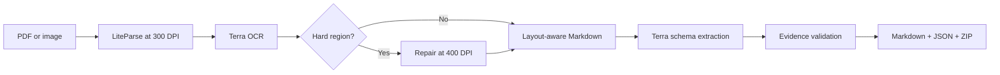

# LiteParse Agentic Document Extraction

[](https://github.com/pypi-ahmad/liteparse-agentic-document-extraction/actions/workflows/ci.yml)

Turn scanned PDFs and images into layout-aware Markdown and evidence-grounded JSON. LiteParse
reconstructs document structure. GPT-5.6 Terra performs OCR, identifies hard regions, and
extracts typed fields.

## What it does

- Upload PDF or image files through the local Streamlit interface.
- Run OCR at 300 DPI, then retry difficult regions at 400 DPI.
- Produce layout-aware Markdown and extract fields with an optional JSON Schema.
- Cite document lines for every non-null extracted value.
- Preview the source and results. Download Markdown, JSON, or a ZIP archive.
- Keep uploads and results only for the current application session.



## Quick start

### Prerequisites

- Windows 11 and PowerShell
- [Git for Windows](https://git-scm.com/downloads/win)
- [uv](https://docs.astral.sh/uv/)
- `OPENAI_API_KEY` available to the process
- Optional `OPENAI_BASE_URL` for the configured compatible endpoint

Check that this PowerShell process has the required key without printing it:

```powershell
if ([string]::IsNullOrWhiteSpace($env:OPENAI_API_KEY)) {
    throw "OPENAI_API_KEY is unavailable; restart PowerShell after configuring it."
}
```

The selected endpoint must support the Responses API, strict structured output, image input,
and `gpt-5.6-terra`.

Clone and install:

```powershell
git clone https://github.com/pypi-ahmad/liteparse-agentic-document-extraction.git
cd liteparse-agentic-document-extraction
uv sync --all-groups --locked
```

Start the app:

```powershell
uv run liteparse-ade
```

Open <http://127.0.0.1:9578>. Or double-click `launch.cmd`. It stops any existing listener on
port `9578` before starting the app.

## Process a document

1. Open **Process documents** in the left sidebar.
2. Upload PDF, PNG, JPEG, TIFF, or WebP files.
3. Describe the fields you want under **Extraction instructions**.
4. Optionally paste or upload a strict JSON Schema.
5. Optionally choose **All** pages or an inclusive **Start page** and **End page** range.
6. Select **Process files**.
7. Review **Source**, **Markdown**, **JSON**, and **Run details**.
8. Download individual results or **Download all results (.zip)**.

Start with the [first-document tutorial](docs/tutorials/first-document.md). The
[documentation index](docs/README.md) lists the rest of the guides.

## Fixed settings

| Setting | Value |
|---|---|
| Model | `gpt-5.6-terra` |
| Reasoning effort | `medium` |
| Base OCR | 300 DPI |
| Hard-region repair | 400 DPI |
| Files per batch | 20 maximum |
| File size | 50 MB maximum |
| Batch size | 500 MB maximum |
| Pages | 100 processed pages per document |
| Repairs | 8 per page, 64 per document |
| Application address | `127.0.0.1:9578` |

See [configuration and limits](docs/reference/configuration.md) for all settings and limits.

## Outputs

For each successfully parsed document, the app produces:

- Markdown preserving headings, paragraphs, tables, and reading order where LiteParse detects
  them.
- JSON schema version `2.0` containing status, stage outcomes, metadata, extracted data,
  evidence, repairs, and issues.
- A ZIP containing collision-safe `.md` and `.json` pairs for all usable documents.

Bounding boxes use `[x1, y1, x2, y2]` in a top-left 72-DPI page viewport. See the
[output JSON reference](docs/reference/output-json.md).

## Privacy and cost

The app stores uploads, OCR caches, and generated artifacts only for the active local session or
in temporary directories. Model requests use `store=False`. The configured OpenAI endpoint
receives document images and parsed content, and processing consumes API credits. Downloaded
files remain in the browser's download location until you delete them. **Clear session** cannot
remove downloaded copies.

## Development

```powershell
uv run ruff format --check .
uv run ruff check .
uv run ty check
uv run pytest
uv build
```

The test suite enforces at least 90% coverage. The optional live check consumes API credits:

```powershell
uv run python tests/live_smoke.py
```

Read [CONTRIBUTING.md](CONTRIBUTING.md) before changing code or prompts.

## Documentation

- [Install and run](docs/how-to/run-the-app.md)
- [Process documents and batches](docs/how-to/process-documents.md)
- [Use a custom extraction schema](docs/how-to/use-a-custom-schema.md)
- [Troubleshoot failures](docs/how-to/troubleshooting.md)
- [Architecture](docs/codebase/architecture.md)
- [Understanding LiteParse](docs/explanation/understanding-liteparse.md)
- [Developer internals](docs/reference/python-internals.md)
- [Project knowledge base](knowledge/index.md) (draft, unverified background research)

Repository: <https://github.com/pypi-ahmad/liteparse-agentic-document-extraction>
