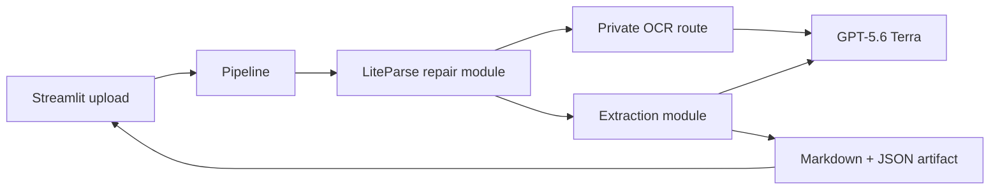

# Architecture

The application is one local process with two cooperating surfaces: a Streamlit UI and a
private Starlette OCR route. LiteParse calls that route while reconstructing document layout;
GPT-5.6 Terra supplies OCR and evidence-grounded extraction.

`server.py` composes the UI and route. `pipeline.py` validates files and builds artifacts.
`repair.py` owns parsing and bounded 400-DPI repair. `extraction.py` owns schemas, evidence,
chunking, retries, and hierarchical merge.
