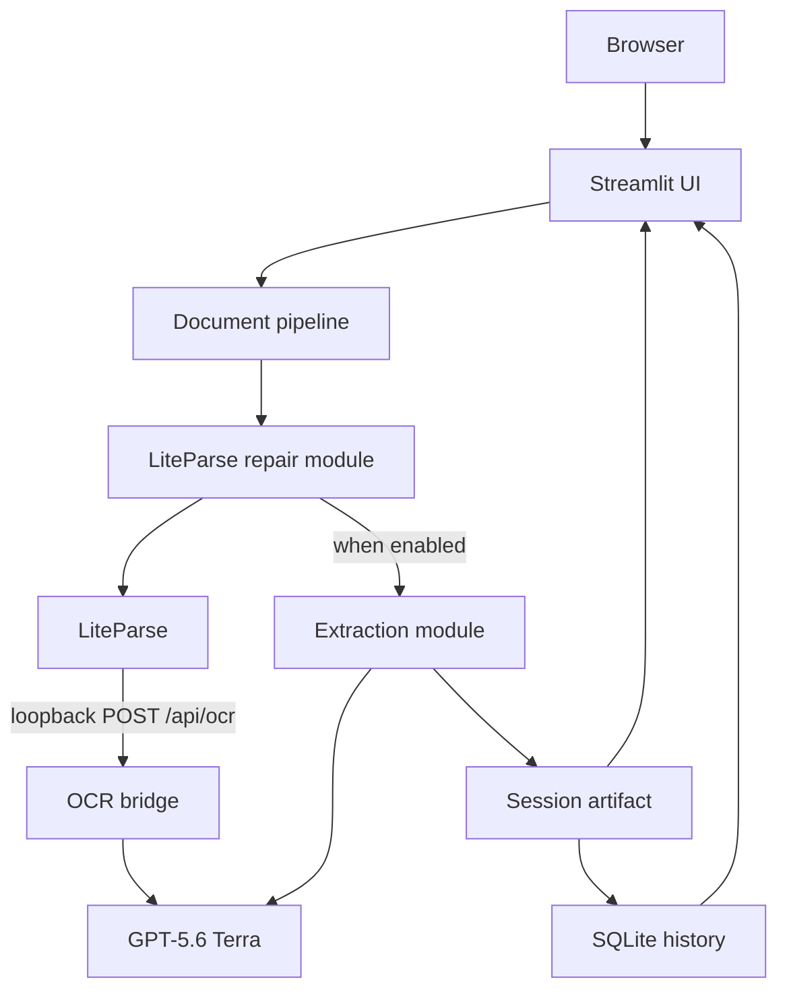

# Architecture

The project is a local, single-process application. Streamlit presents the UI while a private
Starlette route satisfies LiteParse's HTTP OCR interface. Both OCR and extraction use the same
configured GPT-5.6 Terra client.

## Component view

## Boundaries

### Presentation and hosting

`server.py` creates one `st.App` from the packaged `ui.py` script and mounts the private OCR
route. The console command `liteparse-ade` delegates to this server. The UI owns Streamlit
session state but no parsing logic.

### Coordination

`pipeline.py` is the small public coordinator. It validates input, creates a temporary source
file, invokes parsing, optionally invokes extraction, then builds the versioned JSON artifact.
It also serializes individual JSON files and collision-safe ZIP archives.

### Parsing and repair

`repair.py` is the only module that configures LiteParse. It owns preflight page checks, the
300-DPI pass, hard-region selection, 400-DPI repairs, the final parse, and line-evidence catalog.
The OCR bridge owns run-scoped caches so LiteParse can reuse Terra output across these passes.

### Extraction

`extraction.py` owns the strict schema wrapper, evidence validation, bounded chunks, retry
feedback, and hierarchical merge. It receives parsed Markdown and line evidence; it does not
read source files directly. The pipeline calls it only when structured extraction is enabled.

### Persistence

`storage.py` owns SQLite schema initialization, retention, capacity pruning, and artifact
serialization. It stores derived outputs and processing options under the Windows user's local
application-data directory. It never receives or stores source bytes.

## State and trust boundaries

- Browser uploads enter through Streamlit and are untrusted.
- Temporary source files exist only inside a `TemporaryDirectory`.
- OCR caches use random run IDs and accept only active loopback requests.
- Terra receives page images for OCR and parsed content for extraction.
- Model output is untrusted until Pydantic, JSON Schema, coordinate, and evidence checks pass.
- Completed artifacts remain in Streamlit session state until cleared or the session ends.
- Derived Markdown and JSON remain in plaintext SQLite history for up to 30 days.

## Design constraints

- One local process avoids exposing the OCR callback as a standalone service.
- Fixed model and DPI settings keep results comparable between runs.
- Markdown is produced before optional extraction, so a skipped or failed extraction does not
  erase successful parsing.
- SQLite queries bind all values as parameters and enforce retention and payload limits.
- Prompts are packaged Markdown resources, making their content reviewable and hashable.

See [processing flow](processing-flow.md) for the request sequence and
[Python internals](../reference/python-internals.md) for callable-level reference.
