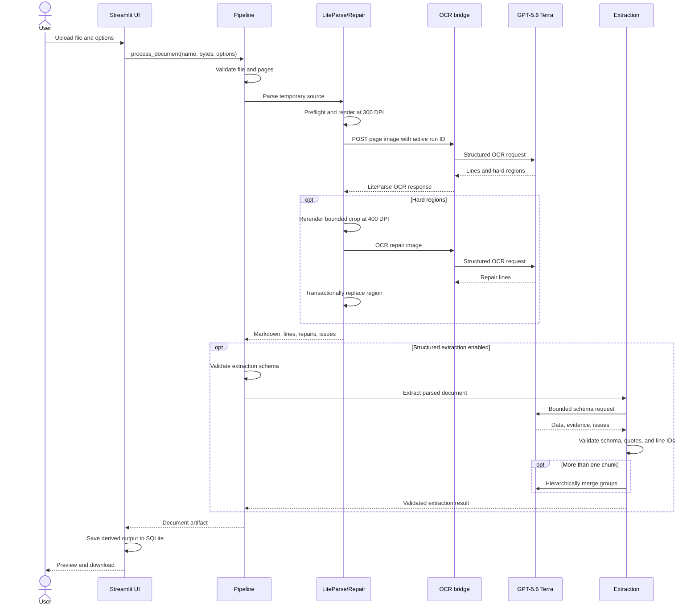

# Processing flow

This page traces one uploaded file from validation to downloadable output.

## Stage behavior

1. **Validation:** Check extension, content signature, size, and page expression before model
   work begins. Validate a schema only when extraction is enabled.
2. **Preflight:** Read the document's page count without OCR. Reject an invalid selection or an
   unselected document over 100 pages.
3. **Base parse:** LiteParse renders and calls the private OCR route at 300 DPI.
4. **Repair:** Merge Terra hard regions with LiteParse grid-fallback blocks, enforce budgets,
   and rerender accepted crops at 400 DPI.
5. **Final parse:** If any repair succeeded, parse again against the amended OCR cache.
6. **Catalog:** Convert page text items into stable line IDs and 72-DPI top-left coordinates.
7. **Extraction:** When enabled, process bounded chunks and validate every non-null value against
   cited text. Otherwise mark the stage `skipped`.
8. **Export:** Combine stage outcomes, provenance, evidence, repairs, and issues into JSON v2.2.
9. **History:** Store the derived artifact and options in bounded SQLite history without source
   bytes.

## Failure preservation

- Invalid input returns a failed artifact before creating temporary work.
- Empty or invalid repair OCR leaves the original 300-DPI region unchanged.
- A final repaired parse failure falls back to the original base Markdown.
- A failed extraction chunk or merge records an issue and preserves successful chunks.
- A total extraction failure still leaves source and Markdown available when parsing succeeded.
- A SQLite failure leaves the current session result available and shows a safe warning.
