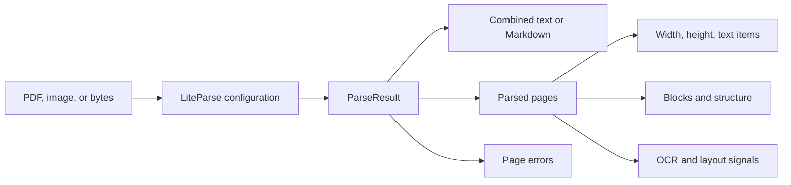
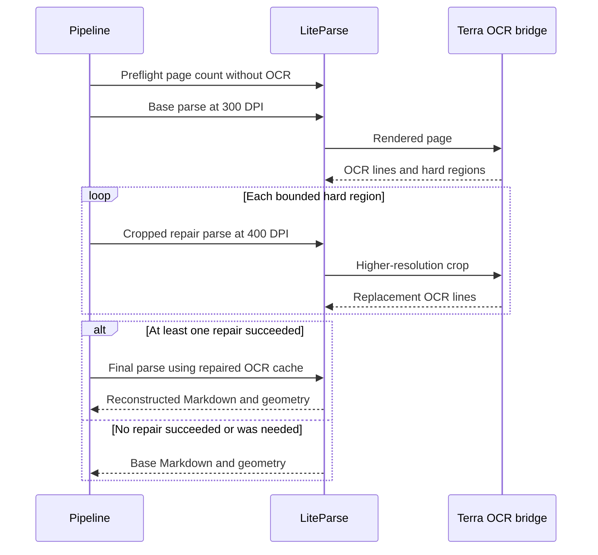

# Understanding LiteParse

LiteParse is the document parser at the center of this application. It turns a PDF or image
into structured page content such as text, Markdown, layout blocks, screenshots, coordinates,
annotations, and form fields. This guide explains what that means, how to use LiteParse by
itself, and how this project combines it with GPT-5.6 Terra.

The examples were checked with LiteParse `2.14.3`, the version currently installed by this
project.

## The problem LiteParse solves

A document carries both characters and layout. Position and layout also carry meaning:

- a large line above a paragraph is probably a heading;
- aligned cells and borders may form a table;
- text in two columns needs the correct reading order;
- a repeated line near every page edge may be a header or footer; and
- a scanned page has pixels but no native text layer.

LiteParse reconstructs these relationships. It handles more than OCR and stops before
business-data extraction.

| Stage | Question it answers | Example output |
|---|---|---|
| OCR | What characters appear in these pixels? | `Invoice INV-7` plus a bounding box |
| Parsing | How is the document organized? | Heading, paragraph, table, page, reading order |
| Extraction | Which business values do I need? | `{"invoice_number": "INV-7"}` |

LiteParse primarily owns the parsing stage. It can read native PDF text and can use an OCR
engine or HTTP OCR service when pages need transcription. It does not decide which invoice,
clinical, or contract fields your application needs.

## A five-minute LiteParse example in this repository

Install this project's locked environment:

```powershell
uv sync --all-groups --locked
```

Place a born-digital PDF with at least three pages and a native text layer at `document.pdf` in
the repository root. Save this example as `liteparse_example.py`:

```python
from liteparse import LiteParse

parser = LiteParse(
    ocr_enabled=False,
    target_pages="1-3",
    output_format="markdown",
    quiet=True,
)
result = parser.parse("document.pdf")

print(result.text)
print(f"Source pages: {result.total_pages}")
for page in result.pages:
    print(page.page_num, page.width, page.height)
```

`target_pages` is inclusive and 1-based. The example processes pages 1 through 3 while
`total_pages` still reports the source document's complete page count. `result.text` contains
the combined requested output and `result.pages` contains individual parsed pages.

Run it from the repository root:

```powershell
uv run python liteparse_example.py
```

Delete the temporary example and input when finished. They are not project files.

> [!IMPORTANT]
> `ocr_enabled=False` is suitable only when the source already contains usable text. Scanned
> pages need an OCR provider. This application supplies Terra through LiteParse's HTTP OCR
> interface; the short standalone example does not configure that private integration.

## The ParseResult mental model



The most useful top-level values are:

| Value | Meaning |
|---|---|
| `result.text` | Combined output in the selected format. |
| `result.pages` | Parsed pages that were requested and completed. |
| `result.total_pages` | Total pages detected in the source document. |
| `result.page_errors` | Page-level failures when processing continues after an error. |
| `result.screenshots` | Rendered pages when screenshot extraction is enabled. |

Each parsed page exposes its page number, width, height, plain text, Markdown, positioned text
items, and optional complexity, blocks, structure, annotations, form fields, or vector data.
Optional values appear only when their corresponding extraction settings are enabled.

## Configuration by intent

LiteParse has options for different output needs. Start with the smallest configuration that
supports the task.

### Choose pages and output

| Option | Purpose |
|---|---|
| `target_pages` | Process one page or an inclusive expression such as `1-3`. |
| `max_pages` | Bound the amount of work accepted from one source. |
| `output_format` | Select combined output such as `markdown`. |
| `keep_headers_footers` | Retain repeated marginal content when it carries meaning. |
| `image_mode` | Omit, embed, or represent document images with placeholders. |

### Request spatial or structural data

| Option | Purpose |
|---|---|
| `extract_screenshots` | Return rendered page images. |
| `extract_blocks` | Return detected layout blocks. |
| `extract_structure_tree` | Return hierarchical document structure. |
| `extract_form_fields` | Return interactive PDF form values where available. |
| `extract_annotations` | Return PDF annotations. |
| `include_complexity` | Return signals about OCR and layout difficulty. |

### Configure OCR and resilience

| Option | Purpose |
|---|---|
| `ocr_enabled` | Enable OCR for image-based text. |
| `ocr_server_url` | Send OCR work to an HTTP provider. |
| `ocr_server_headers` | Attach integration-specific request headers. |
| `ocr_language` | Give the OCR provider a language hint. |
| `dpi` | Control page rendering resolution. |
| `continue_on_page_error` | Keep usable pages when one page fails. |
| `ocr_failure_fatal` | Decide whether OCR failure stops parsing. |
| `num_workers` | Control page-processing concurrency. |

The exact constructor signature is versioned. Inspect the installed version before relying on
an option not used by this project:

```powershell
uv run python -c "from liteparse import LiteParse; import inspect; print(inspect.signature(LiteParse))"
```

## How this project uses LiteParse

This application uses LiteParse as a local, configurable layout engine and Terra as its OCR
provider. The integration has a preflight stage followed by conditional parsing stages:



The base parser enables screenshots, blocks, and complexity signals. Terra returns OCR lines
plus regions it considers difficult. LiteParse's own `grid_fallback` blocks can also request a
repair. Nearby regions are merged and bounded before being rerendered at 400 DPI.

`grid_fallback` means LiteParse detected a table-like region that it could not reconstruct with
its normal grid path. Region merging combines nearby candidates; page and document budgets
bound the number sent through the slower repair path.

Repair is transactional: the pipeline does not remove 300-DPI lines unless the 400-DPI crop
returns valid lines that map inside the target region. A failed repair records an issue and
retains the base text.

After parsing, the project converts positioned page text into stable evidence lines. Terra then
extracts business fields from the Markdown, while local validation checks its quotes and line
IDs. LiteParse itself does not perform this schema extraction.

## Why the application reparses after repair

Replacing OCR lines changes the content LiteParse uses to infer reading order, paragraphs, and
tables. Updating only the final Markdown string would bypass those layout rules. A final pass
lets LiteParse reconstruct the page using the amended OCR cache.

If the final pass fails, the application falls back to the original 300-DPI parse and removes
repair receipts. This keeps the artifact honest: reported repairs always correspond to the
Markdown actually returned.

## When LiteParse fits

LiteParse is useful when you need:

- a local parsing engine with explicit configuration;
- page-level Markdown and plain text;
- spatial evidence and layout blocks;
- control over rendering, page selection, and OCR integration;
- partial results when individual pages fail; or
- inspectable complexity signals for escalation decisions.

Its local parser also keeps orchestration under application control. In this project, the code
decides when to call OCR, when to spend extra work on a crop, and when partial output is safe to
return.

## Limits and common failure modes

Document parsing remains heuristic. Dense forms, irregular tables, handwriting, overlapping
content, unusual fonts, multi-column reading order, and low-quality scans can produce missing,
duplicated, or reordered text.

Watch for these symptoms:

| Symptom | Likely layer | Response |
|---|---|---|
| Empty text on a scan | OCR disabled or failed | Enable a suitable OCR provider and inspect page errors. |
| Repeated text | OCR/layout overlap | Compare positioned items and blocks; narrow the affected region. |
| Flattened table | Layout reconstruction | Enable blocks/structure and inspect grid fallback signals. |
| Wrong reading order | Complex page layout | Inspect page geometry and consider targeted escalation. |
| Missing pages | Selection or page error | Check `target_pages`, `total_pages`, and `page_errors`. |
| Large output | Screenshots or embedded images | Disable unused spatial/image outputs. |

Higher DPI is not automatically better. It increases rendered pixels, request size, latency,
and cost. This application uses 300 DPI by default and reserves 400 DPI for bounded hard
regions.

## LiteParse versus hosted parsers

LiteParse gives the application direct control over parsing and OCR routing. Hosted parsers can
bundle OCR, layout models, grounding, scaling, and operational support behind an API. Evaluate
representative documents, required evidence, privacy boundaries, latency, cost, and failure
recovery before choosing a parser.

Measure representative documents before choosing a parser. Define normalization, token and
layout metrics, page scope, expected structures, and review thresholds so results are
reproducible rather than relying on one visual comparison.

## Learn more

- [LiteParse product page](https://www.llamaindex.ai/liteparse)
- [LiteParse source repository](https://github.com/run-llama/liteparse)
- [This application's architecture](../codebase/architecture.md)
- [300/400-DPI repair strategy](../codebase/repair-strategy.md)
- [Evidence-grounded extraction](../codebase/extraction-strategy.md)
- [Process documents in the UI](../how-to/process-documents.md)

The repository's [LiteParse knowledge profile](../../knowledge/concepts/liteparse.md) contains
additional research context. It is currently marked **draft and unverified**; current source,
tests, and installed API signatures govern this application's behavior.
